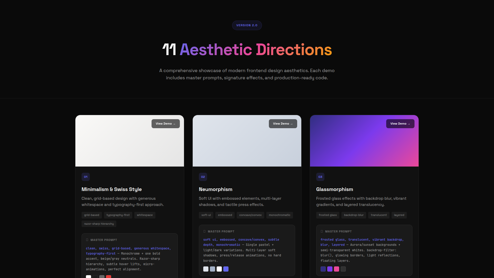
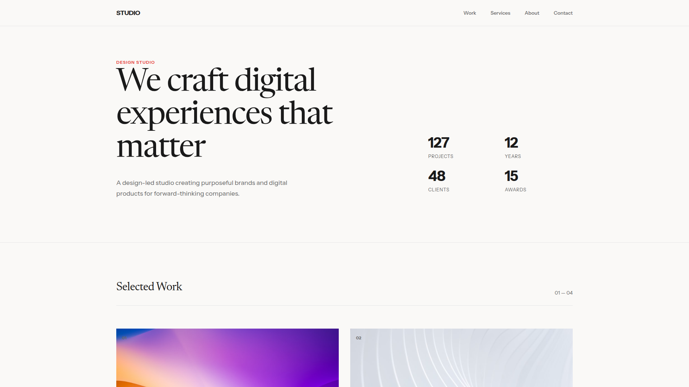
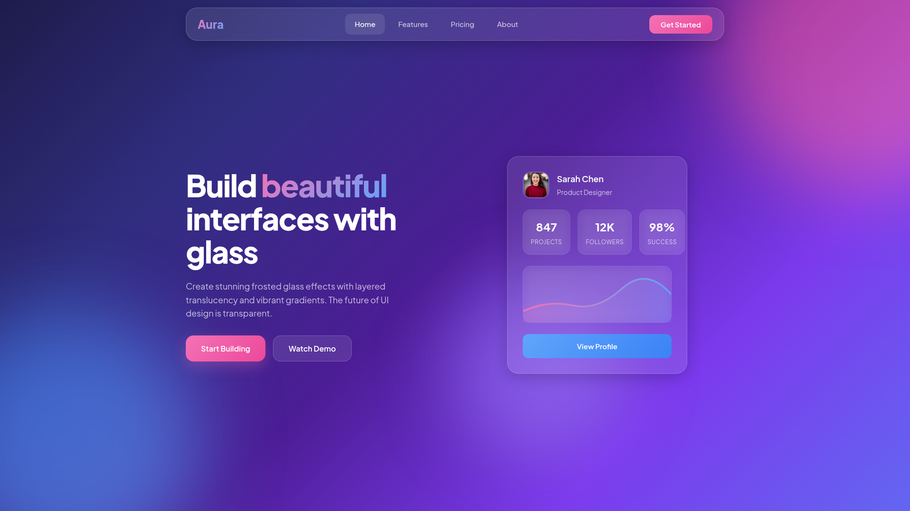
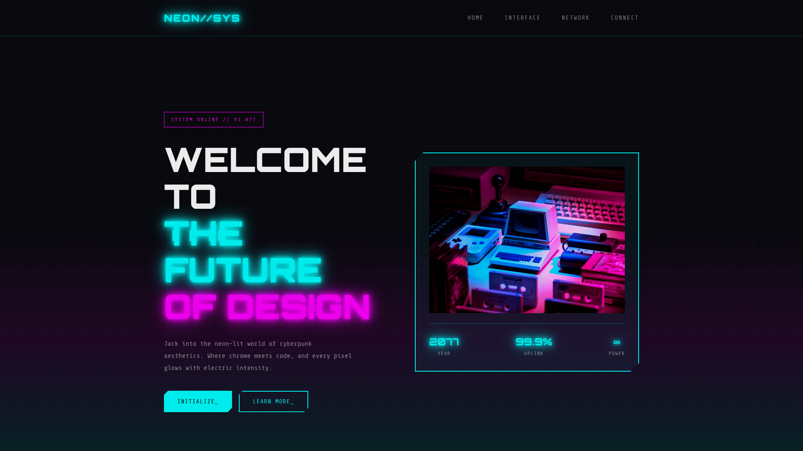
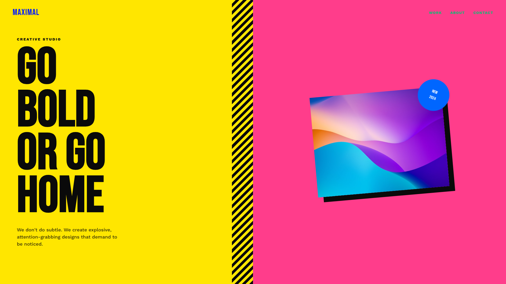
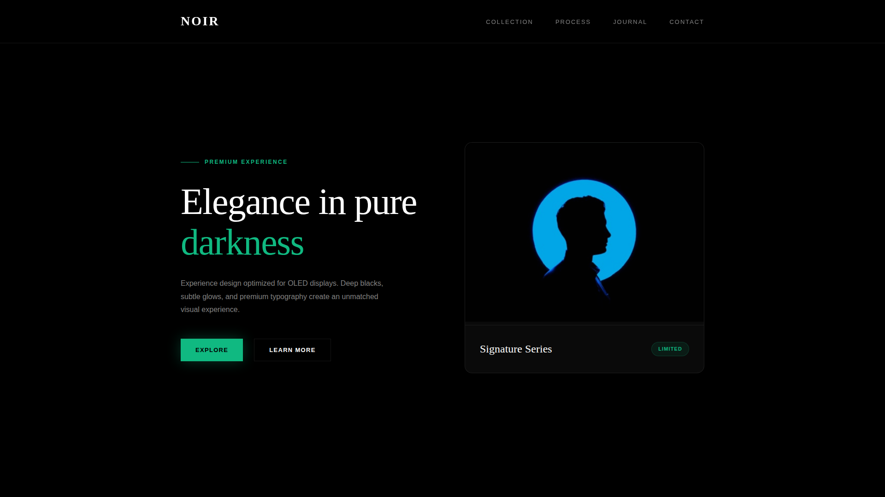
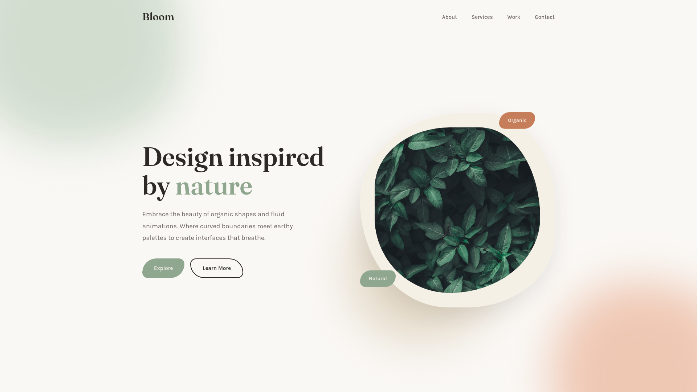

# Visual Workbench

**AI-powered presentation builder that generates agency-quality slides from a single chat prompt.**

Type what you want. Get a stunning, production-ready HTML slide in seconds. 11 premium aesthetic styles. Real-time preview. Export to PowerPoint.

---



---

## What It Does

Visual Workbench connects an AI chat interface to a live HTML renderer. You describe a slide — "a pricing page with glassmorphism effect" — and the AI generates a complete, self-contained HTML/CSS file that renders instantly in your browser.

No templates. No drag-and-drop. Just natural language to pixel-perfect slides.

## Features

- **Chat-to-Slide** — Describe what you want, get a full HTML slide in real-time
- **11 Premium Styles** — Minimalist, Glassmorphism, Brutalism, Cyberpunk, OLED Luxury, and more
- **Live Preview** — See your slide render instantly in an iframe sandbox
- **Multi-Screen** — Build entire presentations, not just single slides
- **Image Support** — Paste screenshots directly into the chat for reference
- **Theme Toggle** — Light and dark mode for the workbench itself
- **PPT Export** — Convert your slides to PowerPoint with one click
- **Session Memory** — Your chat history and screens persist across refreshes

## Style Gallery

| # | Style | Description |
|---|-------|-------------|
| 01 | **Minimalism & Swiss** | Grid-based, massive typography, generous whitespace |
| 02 | **Neumorphism** | Soft UI, embossed elements, subtle depth |
| 03 | **Glassmorphism** | Frosted glass, backdrop blur, layered translucency |
| 04 | **Brutalism** | Raw, high contrast, thick borders, intentionally rough |
| 05 | **Claymorphism** | Chunky 3D clay, bubbly shapes, candy pastels |
| 06 | **Aurora / Mesh Gradient** | Flowing northern lights, luminous color blends |
| 07 | **Retro-Futurism / Cyberpunk** | Neon glow, CRT scanlines, glitch effects |
| 08 | **3D Hyperrealism** | Realistic textures, cinematic lighting, metallic |
| 09 | **Vibrant Block / Maximalist** | Bold clashing colors, geometric energy |
| 10 | **Dark OLED Luxury** | Absolute black, gold accents, subtle glow |
| 11 | **Organic / Biomorphic** | Fluid shapes, nature-inspired, morphing blobs |

## Architecture

```
┌──────────────────────────────────────────────────┐
│                   Browser UI                      │
│  ┌──────────────┐  ┌──────────────────────────┐  │
│  │  Chat Panel  │  │      Viewer Panel        │  │
│  │  (streaming) │  │  (live HTML preview)     │  │
│  └──────┬───────┘  └──────────────────────────┘  │
│         │                                         │
└─────────┼─────────────────────────────────────────┘
          │ HTTP
          ▼
┌──────────────────────────────────────────────────┐
│         opencode serve (localhost:4096)           │
│  Routes to Gemini / GPT / Claude / any provider  │
└──────────────────────────────────────────────────┘
```

## Quick Start

### Prerequisites

- Node.js 18+
- opencode CLI (`npm install -g opencode-ai`)
- Configured AI model provider in opencode

### 1. Start the AI server

```bash
opencode serve --cors http://localhost:5173
```

### 2. Start the UI

```bash
cd Visual-Workbench/ui
npm install
npm run dev
```

### 3. Open the browser

Navigate to `http://localhost:5173`

### 4. Start creating

Type a prompt like:
- "Create a pricing page with glassmorphism style"
- "Build a team slide with brutalist typography"
- "Design a product showcase with dark OLED luxury"

## Project Structure

```
Visual-Workbench/
├── ui/                          # React + TypeScript + Vite
│   ├── src/
│   │   ├── components/          # Chat, Viewer, Carousel
│   │   ├── stores/              # Zustand state management
│   │   └── styles/              # Theme system (light/dark)
│   └── package.json
├── server/                      # Hono backend
│   ├── src/
│   │   ├── routes/              # Auth, chat, screens, export
│   │   └── services/            # AI provider, Google auth
│   └── package.json
├── skills/                      # AI design skills
│   ├── frontend-design-pro/     # 11 aesthetic style guide
│   └── visual-workbench/        # Slide generation rules
├── examples/demos-v02/          # 11 reference implementations
│   ├── screenshots/             # Preview images
│   └── *.html                   # Full demo slides
├── scripts/                     # Export tools (Python)
│   └── export-ppt.py
└── SPEC.md                      # Full technical specification
```

## How It Works

1. **You chat** — The left panel sends your message to the AI via opencode
2. **AI generates** — The AI reads the `frontend-design-pro` skill and generates complete HTML/CSS
3. **Live render** — The right panel renders the HTML in a sandboxed iframe
4. **Iterate** — Ask for changes, the AI refines the slide in real-time
5. **Export** — Convert your slides to PowerPoint when ready

## Design Skills

The AI uses two bundled skills to generate premium output:

### `frontend-design-pro`
- 11 aesthetic directions with exact CSS techniques
- Characterful fonts (never generic system fonts)
- Signature details: grain, mesh gradients, custom cursors
- WCAG AA accessible
- Real images from Unsplash/Pexels or AI image prompts

### `visual-workbench`
- Slide generation rules (16:9, self-contained HTML)
- Context from example slides
- Style selection based on user intent

## Tech Stack

| Layer | Technology |
|-------|------------|
| Frontend | React 18, TypeScript, Vite, Zustand |
| Backend | Hono (Node.js) |
| State | Zustand with localStorage persistence |
| Export | Python + python-pptx |
| AI | Any model via opencode (Gemini, GPT, Claude) |

## Demo Screenshots

<table>
<tr>
<td align="center"><strong>01. Minimalism & Swiss</strong></td>
<td align="center"><strong>03. Glassmorphism</strong></td>
<td align="center"><strong>07. Cyberpunk</strong></td>
</tr>
<tr>
<td></td>
<td></td>
<td></td>
</tr>
<tr>
<td align="center"><strong>09. Vibrant Block</strong></td>
<td align="center"><strong>10. Dark OLED Luxury</strong></td>
<td align="center"><strong>11. Organic / Biomorphic</strong></td>
</tr>
<tr>
<td></td>
<td></td>
<td></td>
</tr>
</table>

## Environment Variables

### Server (`server/.env`)

```env
GOOGLE_CLIENT_ID=your_google_client_id
GOOGLE_CLIENT_SECRET=your_google_client_secret
GOOGLE_REDIRECT_URI=http://localhost:3001/auth/callback
GEMINI_API_KEY=your_gemini_api_key
PORT=3001
```

See `server/.env.example` for reference.

### UI (optional `.env`)

```env
VITE_OPENCODE_URL=http://127.0.0.1:4096
VITE_OPENCODE_USER=your_username
VITE_OPENCODE_PASS=your_password
```

## License

MIT

---

Built by [SatyaDileep](https://github.com/SatyaDileep)
